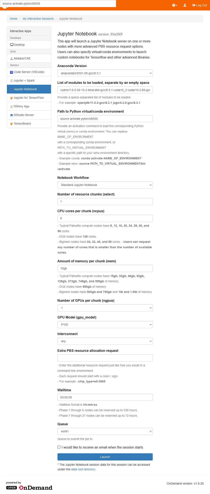

# Installing and running PyTorch on Palmetto

[PyTorch installation for P100/V100/A100](#pytorch-installation-for-p100v100a100) 
[PyTorch in Terminal](#pytorch-in-terminal) 
[PyTorch on OpenOnDemand](#pytorch-on-openondemand) 

This page explains how to install the [PyTorch](https://pytorch.org/) 
package for use with GPUs on the cluster, and how to launch a JupyterLab 
Server with PyTorch environment on 
[OpenOnDemand](https://openod02.palmetto.clemson.edu).

## PyTorch installation for P100/V100/A100

0) Log in the cluster. Instruction is available at [https://www.palmetto.clemson.edu/palmetto/basic/login/](https://www.palmetto.clemson.edu/palmetto/basic/login/)

1) Request an interactive session on a GPU node.

~~~
qsub -I -l select=1:ncpus=16:mem=20gb:ngpus=1:gpu_model=p100:interconnect=10ge,walltime=3:00:00
~~~

Wait until the resources are successfully allocated:

~~~
qsub (Warning): Interactive jobs will be treated as not rerunnable
qsub: waiting for job 4646626.pbs02 to start
qsub: job 4646626.pbs02 ready
~~~

2) Load the Anaconda, cuda, cuDNN modules:

Ideally, there is no Python installed before loading.
If you are not sure, check by

~~~
which python
~~~

~~~
module load anaconda3/2021.05-gcc/8.3.1 cudnn/7.6.5.32-10.2-linux-x64-gcc/8.3.1-cuda10_2 cuda/10.2.89-gcc/8.3.1
~~~

Check whether the modules are succesffully loaded:

~~~
nvcc --version
which python
which conda
~~~

> To list the available modules, refer to [Modules at Palmetto](https://www.palmetto.clemson.edu/palmetto/software/software/#modules).

3) Create a conda environment called `pytorch8550` (or any name you like):

~~~
conda create -n pytorch8550 anaconda python=3.9
~~~

4) Activate the conda environment:

~~~
source activate pytorch8550
~~~

5) Install Pytorch with GPU support from the pytorch channel:

~~~
conda install pytorch torchvision torchaudio cudatoolkit=10.2 -c pytorch
~~~

6) You can now run Python and test the install:

~~~~
python
>>> import torch
>>> print(torch.cuda.is_available())
True
>>> print(torch.cuda.get_device_name(0))
Tesla P100-PCIE-12GB
~~~~

## PyTorch in Terminal

Each time you login, you will first need to request harware resources, load the required modules, and also activate the `pytorch8550` conda environment before running Python:

~~~
qsub -I -l select=1:ncpus=16:mem=20gb:ngpus=1:gpu_model=p100:interconnect=10ge,walltime=3:00:00
module load anaconda3/2021.05-gcc/8.3.1 cudnn/7.6.5.32-10.2-linux-x64-gcc/8.3.1-cuda10_2 cuda/10.2.89-gcc/8.3.1
source activate pytorch8550
~~~

## PyTorch on OpenOnDemand

If you want to write code using JupyterLab, the browser-based notebook is a better choice.

- Go to [Palmetto's OpenOnDemand](https://openod02.palmetto.clemson.edu/) and sign in. 
- Under `Interactive Apps` tab, select `Jupyter Notebook`. 
- Make the following selections:
  - Anaconda Version: `anaconda3/2021.05-gcc/8.3.1`
  - List of modules to be loaded, separate by an empty space: `cudnn/7.6.5.32-10.2-linux-x64-gcc/8.3.1-cuda10_2 cuda/10.2.89-gcc/8.3.1`
  - Path to Python virtual/conda environment: `source activate pytorch8550`
- Make the remaining selections according to how much resources you would need.
  - Number of resource chunks: `1`
  - CPU cores per chunk: `8`
  - Amount of memory per chunk: `10gb`
  - Number of GPUs per chunk: `1`
  - GPU Model: `P100`
  - Interconnect: `any`
  - Walltime: `02:00:00`
- Click `Launch` when done.    

Once the JupyterNotebook app has started, you can Connect to Jupyter.

As the Jupyter Server is launched directly out of the `jupyterlab` package
installed in the `pytorch` conda environment, no special kernel is needed. 
You can import and use PyTorch directly from the default `Python 3` kernel. 

You can create a notebook and run some tesing code.

## Reference
1. [Palmetto Documentation](https://www.palmetto.clemson.edu/palmetto/basic/login/)
2. [Palmetto Examples by Clemson Cyberinfrastructure Technology Integration](https://github.com/clemsonciti/palmetto-examples)